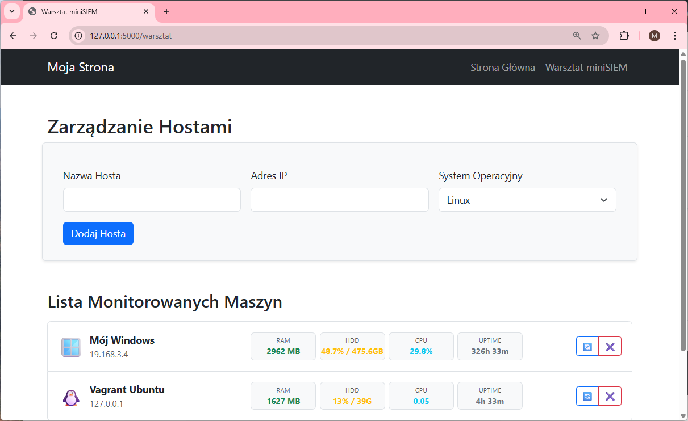

# Lab 7: Monitoring Systemów z Flaskiem (Dashboard SIEM)

Witaj w laboratorium! Twoim zadaniem jest zbudowanie backendu aplikacji typu **Dashboard Monitorujący**. Frontend (HTML, CSS, JS) został już dla Ciebie przygotowany. Skupisz się na stworzeniu API w Pythonie (Flask), obsłudze bazy danych oraz pobieraniu informacji o systemie (lokalnie przez `psutil` i zdalnie przez SSH).

---

## 0. Zawartość Starter Packa

Otrzymałeś paczkę startową. Zanim zaczniesz, zapoznaj się z jej strukturą, aby wiedzieć co gdzie leży.
Zwróć uwagę, że **templates** i **static** znajdują się wewnątrz katalogu `app`.

```text
Lab-7-Starter/
│
├── app/
│   ├── blueprints/
│   │   └── api/
│   │       └── hosts.py         # [DO UZUPEŁNIENIA] Szkielet endpointów API (CRUD + Info).
│   │                            # Tutaj połączysz logikę z bazą danych.
│   │
│   ├── services/
│   │   ├── remote_client.py     # [GOTOWY] Wrapper na bibliotekę Paramiko (SSH).
│   │   │                        # Nie musisz go edytować, będziesz go używać.
│   │   └── system_info.py       # [DO UZUPEŁNIENIA] Logika biznesowa pobierania danych.
│   │                            # Gotowa funkcja dla Linuxa, pusta dla Windowsa.
│   │
│   ├── static/                  # [GOTOWY] Pliki frontendowe (CSS/JS).
│   │   ├── css/
│   │   │   └── style.css        # Style aplikacji.
│   │   └── js/
│   │       ├── api.js           # Definicje połączeń fetch (API wrapper).
│   │       ├── config_hosts.js  # Logika tabeli i kafelków (badges).
│   │       ├── dom.js           # Helpery do tworzenia elementów HTML.
│   │       └── main.js          # Główny skrypt startowy.
│   │
│   └── templates/               # [GOTOWY] Szablony HTML (Jinja2).
│       ├── base.html            # Główny layout (navbar, stopka).
│       ├── index.html           # Strona główna (O mnie).
│       └── practice.html        # Widok "Warsztat miniSIEM" (Dashboard).
│
├── requirements.txt             # Lista bibliotek do zainstalowania.
└── README.md                    # Niniejsza instrukcja.
```

W katalogu głównym **brakuje** plików startowych (`run.py`, `config.py`) oraz pliku inicjalizującego pakiet aplikacji (`app/__init__.py`). Twoim pierwszym zadaniem jest ich utworzenie.

---

## 1. Przygotowanie Środowiska

Zacznij od przygotowania wirtualnego środowiska Pythona:

1.  Otwórz terminal w katalogu projektu.
2.  Utwórz venv: `python -m venv venv`
3.  Aktywuj venv:
    *   Windows: `venv\Scripts\activate`
    *   Mac/Linux: `source venv/bin/activate`
4.  Zainstaluj wymagane biblioteki:
    ```bash
    pip install -r requirements.txt
    ```

---

## 2. Budowa Struktury Aplikacji

W katalogu głównym utwórz brakujące pliki startowe:

### A. Konfiguracja (`config.py`)
Utwórz plik `config.py` w głównym katalogu:
```python

class Config:
    SECRET_KEY = 'sekretny-klucz'
    SQLALCHEMY_DATABASE_URI = "sqlite:///../instance/lab7.db"
    SQLALCHEMY_TRACK_MODIFICATIONS = False

    
    # Konfiguracja SSH (dla maszyny Vagrant)
    SSH_DEFAULT_USER = 'vagrant'
    SSH_DEFAULT_PORT = 2222
    # 🔑 jedna z dwóch metod autoryzacji (tylko jedna powinna być aktywna)
    #SSH_PASSWORD = "vagrant"   # logowanie hasłem
    #SSH_KEY_FILE logowanie kluczem, poniżej przykładowy klucz
    #SSH_KEY_FILE = r"c:\Mirek\cyber-lab\vagrant-ok\.vagrant\machines\default\virtualbox\private_key"
    SSH_KEY_FILE = r"" # TUATJ wpisz swój klucz
```

### B. Rozszerzenia (`app/extensions.py`)
Utwórz plik `app/extensions.py`, aby zainicjalizować instancje pluginów (aby uniknąć cyklicznych importów):
```python
from flask_sqlalchemy import SQLAlchemy
from flask_migrate import Migrate

db = SQLAlchemy()
migrate = Migrate()
```

### C. Fabryka Aplikacji (`app/__init__.py`)
Utwórz plik app/__init__.py. To tutaj skonfigurujesz całą aplikację.
Napisz funkcję create_app().
Wewnątrz: utwórz obiekt Flask, wczytaj konfigurację, zainicjalizuj db i migrate.

Zarejestruj Blueprinty (które stworzysz w punkcie 4).
Ważne: Dodaj automatyczne tworzenie bazy danych jeśli nie korzystasz z migracji. Wewnątrz funkcji create_app dopisz:
```Python
db.init_app(app)
with app.app_context():
    # Import modelu jest konieczny tutaj, aby SQLAlchemy o nim wiedziało
    from .models import Host  <-- ODKOMENTUJ TO w kroku 3!
    db.create_all()
```
Zwróć app.

### D. Punkt wejścia (`run.py`)
Utwórz plik `run.py`. Zastosujemy tu prosty mechanizm tworzenia bazy danych przy starcie:
```python
from app import create_app
app = create_app()

if __name__ == '__main__':
        
    app.run(debug=True)
```

---

## 3. Baza Danych i Modele

### A. Model Host (`app/models.py`)
Utwórz plik `app/models.py`. Zdefiniuj klasę `Host` dziedziczącą po `db.Model`.
Wymagane pola:
*   `id` (Integer, Primary Key)
*   `hostname` (String)
*   `ip_address` (String, Unique)
*   `os_type` (String) – przechowuje "WINDOWS" lub "LINUX".

*Wskazówka: Dodaj metodę `to_dict(self)`, zwracającą słownik z danymi obiektu – ułatwi to tworzenie API.*

### B. Inicjalizacja Bazy
Jeśli użyłeś kodu w `run.py` (sekcja 2D), baza `app.db` utworzy się automatycznie przy pierwszym uruchomieniu aplikacji.

*Dla chętnych (Opcja Profesjonalna):* Możesz użyć migracji zamiast `db.create_all()`.
1. `flask db init`
2. `flask db migrate -m "Start"`
3. `flask db upgrade`

---

## 4. Routing i Blueprinty

### A. UI Blueprint (`app/blueprints/ui.py`)
Utwórz ten plik. Stwórz trasy `/` (renderuje `index.html`) oraz `/warsztat` (renderuje `practice.html`). Pamiętaj o zarejestrowaniu tego blueprinta w `app/__init__.py`.

### B. API Blueprint (`app/blueprints/api/hosts.py`)
Plik już istnieje.
1.  Uzupełnij sekcję **CRUD** (`get_hosts`, `add_host`, `delete_host`).
2.  Zarejestruj ten blueprint w `app/__init__.py` z prefiksem `/api`.

---

## 5. Logika Monitoringu (psutil & SSH)

### A. Analiza `app/services/system_info.py`
Otwórz ten plik.
*   Funkcja `get_linux_metrics` jest **gotowa**.
*   Funkcja `get_windows_metrics` jest **pusta**. Uzupełnij ją używając biblioteki `psutil`.
    *   Wymagane klucze w słowniku zwracanym przez funkcję:
        *   `free_ram_mb`: Wolna pamięć (MB).
        *   `disk_info`: Zajętość dysku (%).
        *   `disk_total`: Całkowity rozmiar dysku (np. "100GB").
        *   `cpu_load`: Obciążenie CPU (%).
        *   `uptime_hours`: Czas pracy systemu.
    *   **Uwaga:** `disk.total` w psutil zwraca bajty. Podziel przez `(1024**3)`, aby uzyskać GB.

### B. Łączenie w `app/blueprints/api/hosts.py`
1.  W endpoincie `/ssh-info`: Odkomentuj gotowy kod łączący się z `RemoteClient`.
2.  W endpoincie `/windows-info`:
    *   Pobierz hosta z bazy.
    *   Upewnij się, że to system WINDOWS.
    *   Wywołaj swoją funkcję `get_windows_metrics()`.
    *   Zwróć JSON.

---

## 6. Testowanie

1.  Uruchom aplikację: `flask run`.
2.  Wejdź na stronę "Warsztat miniSIEM" (link w menu).
3.  Dodaj hosta lokalnego:
    *   Hostname: `Mój PC`
    *   IP: `127.0.0.1`
    *   OS: `WINDOWS`
4.  Kliknij przycisk **"Sprawdź"**. Powinieneś zobaczyć kafelki z aktualnymi danymi Twojego komputera!

## 7. Oczekiwany wygląd strony
